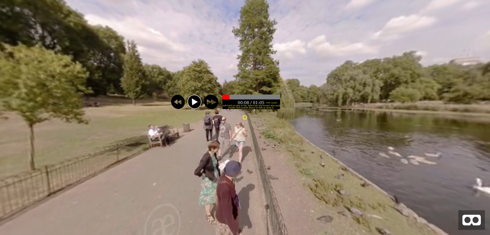

# AframeNG2VideoPlayer

Originally forked from [oscarmarinmiro](https://github.com/oscarmarinmiro/aframe-video-controls)

## Controls

* Click and Drag- To view around the 360 environment
* WASD- moves the camera in, left, out, right respectively
* To Play or Fast-Forward drag the cursor over the respective button and click
* The left and right arrows will move the playback to the beginning or end fo the video
* The spacebar can be used for play/pause toggle
* **Reverse Not Implemented**

## Screenshot

